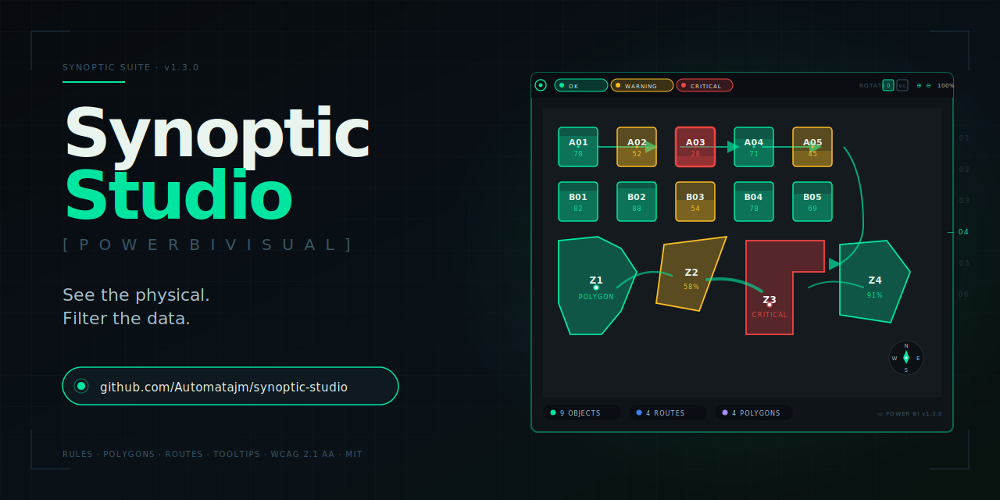

# Synoptic Studio — Power BI Custom Visual

<p align="center">
  
</p>

<p align="center">
  <a href="https://github.com/Automatajm/synoptic-studio/releases"></a>
  <a href="LICENSE"></a>
  
  
  
  
</p>

> **A configurable synoptic map visual for Power BI.** Place any object on a canvas — rectangles or irregular polygons — define color rules against your data, connect them with routes, and get instant cross-filtering. Built for operations teams who need to see their physical world in data.

**🎨 Design layouts visually:** [Synoptic Studio Editor](https://synoptic-studio-editor.vercel.app) — a free web app that lets you trace shapes over any image and export them ready for this visual.

---

## What is Synoptic Studio?

Synoptic Studio renders the physical world of your business — greenhouses, hotel rooms, dental seats, parking spots, factory stations, server racks, theater seats, supply chain routes — as a live, color-coded, cross-filterable map.

You provide:
- A list of objects with IDs (`A01`, `Rack-04`, `Seat-12B`, `Zone-Z3`)
- Their physical positions on the canvas (X, Y, width, height) — or polygon vertices for irregular shapes
- A primary metric (occupancy %, status, alert level)
- Color rules that drive how each object looks
- Optionally: a background image, route connections between objects, custom centroid positions

The visual produces a synoptic map that updates in real time, supports rotation, zoom, pan, dark/light themes, full keyboard navigation, and acts as a slicer for the rest of your report.

---

## Built for operations teams

Originally designed for large-scale ornamental plant production (118 greenhouses, 2.8M plants), Synoptic Studio solves the core problem of any field operations dashboard:

> *"I need to see the status of every physical location at a glance, colored by what matters today — and click on any one to drill into the details."*

---

## The Synoptic Suite

This visual is part of a small ecosystem:

| Product | What it is | Link |
|---|---|---|
| **Synoptic Studio** (this) | Power BI custom visual | This repo |
| **Synoptic Studio Editor** | Web app for tracing layouts over images | [Live demo](https://synoptic-studio-editor.vercel.app) · [Source](https://github.com/Automatajm/synoptic-studio-editor) |

The editor lets you upload any image (floor plan, satellite view, blueprint, anatomical chart, parking lot photo) and trace shapes with rectangles or polygons. Then it exports an Excel/CSV ready for this visual — Object IDs, coordinates, polygon points, centroid anchors, image URL, all in one file. You can also write the file by hand if you prefer.

---

## Use case examples

| Industry | Object | Main Value | Text Field 1 | Tooltip Fields |
|---|---|---|---|---|
| Agriculture | Greenhouse | Occupancy % | Status | Empty beds, plants, m² |
| Hospitality | Hotel room | Occupancy % | Status | Guest, check-out, rate |
| Healthcare | Dental seat / chart | Health % | Tooth condition | Last visit, treatment plan |
| Aviation | Aircraft seat | Booked | Class | Passenger, special meal |
| Manufacturing | Workstation | Utilization % | Status | Operator, output, downtime |
| Data Center | Server rack | CPU load % | Health | Temperature, alerts, uptime |
| Retail | Parking spot | Occupied | Status | Vehicle, time parked |
| Logistics | Warehouse zone | Capacity % | Stock level | Items, reorder date |
| Supply Chain | Distribution route | Volume | Carrier | Delivery time, cost |
| Real Estate | Building unit | Available | Status | Tenant, sq ft, price |

---

## Key Features

### 🎨 Color Rules Engine
Built-in visual editor — no JSON required. Add rules with operators (`=`, `≠`, `>`, `≥`, `<`, `≤`, `between`). First match wins. Rules persist across reload, close/reopen, and report publishing via `persistProperties`.

- **Smart `between` operator** — single-input syntax: `"3, 8"`, `"[3, 8]"`, `"3..8"`, `"3 - 8"`. Auto-sorts. Live red-border validation.
- **Curated 14-color palette** — neutrals first (carbon, slate, white), then semaphore order (red, orange, amber, green, teal), then accents. All work in light and dark themes.
- **Disable without deleting** — toggle rules on/off with a checkbox; reorder with ↑↓; first match wins.

### 🔷 Polygons + Rectangles
Mixed-shape support in the same canvas:

- **Rectangles** — via `Layout X / Y / W / H` data roles
- **Polygons** — via `Polygon Points` data role (format: `"x1,y1;x2,y2;x3,y3;..."` in relative 0–100 coordinates)
- Use polygons for irregular zones (L-shapes, dental charts, geographical regions, anatomical diagrams)
- Bounding box is auto-calculated; manual centroid override available for label positioning

### 🎯 Centroid System (label / route anchor)
Every object has a centroid — the position where the label sits and where routes attach. For complex shapes (L, U, donut, irregular polygons), the geometric center can fall outside the silhouette. Synoptic Studio supports:

- **Geometric centroid** (default) — area-weighted, falls back to bounding-box center
- **Manual override** — set `Centroid X` and `Centroid Y` columns from the editor's drag-to-position anchor
- Used downstream for route endpoints, label placement, and nearest-neighbor analysis

### 🛣️ Routes (lines connecting objects)
Two modes, both optional:

#### Linear routes
Bind a numeric column to **Route Order** (1, 2, 3, …). The visual draws lines connecting object centroids in order with direction arrows. Use for: supply chain paths, inspection routes, customer journey maps, evacuation paths.

#### Graph routes
Bind **Route From** and **Route To** to source/destination Object IDs. Each row in the data represents one edge. Optionally bind **Route Weight** to a numeric measure so heavier edges show with thicker lines. Use for: networks, dependencies, traffic flow, communication graphs.

Routes card in the Format pane controls color, thickness, opacity, and arrow visibility.

### 🖼️ Background Image
Bind a URL to the **Background Image URL** data role and the visual renders the image behind the objects. Configurable opacity (0–100%) so rule colors can dominate or the picture can shine through.

Works with:
- External URLs (Imgur, S3, GitHub raw, your CDN)
- Base64 data URIs embedded in the dataset (good for small images; respects Power BI's 32K cell cap)

### 💡 Multi-field tooltips
Single **Tooltip Fields** bucket accepts measures, dates, and text in any combination. Auto-detects type. Strips PBI prefixes (`Sum of`, `Avg of`) by default while respecting user renames. Order preserved from drag sequence.

### 🎨 Theme adaptation
Detects active Power BI report theme via `host.colorPalette.background` and adapts text, fills, and contrast automatically. Uses **WCAG luminance** to ensure value text remains legible on any background.

### 🌐 Localization (EN / ES)
Visual UI strings adapt to the user's Power BI language setting:
- **English** (default)
- **Spanish** (es-ES)

Field display names, format pane labels, tooltip headers, and error messages all switch automatically.

### ⌨️ Keyboard Navigation (WCAG 2.1 AA)
Full keyboard accessibility — meets AppSource Tier 3 certification requirements:

| Key | Action |
|---|---|
| `Tab` | Move focus between objects |
| `Enter` / `Space` | Select / activate the focused object |
| `Ctrl+Enter` / `Ctrl+Space` | Multi-select |
| `Escape` | Clear selection |
| `Shift+Tab` | Move focus backward |

Each object has `tabindex=0`, `role=button`, and an `aria-label` combining the object's Label and current rule.

### 🧭 Compass with fixed stator
The ring and N/S/E/W letters stay screen-anchored; only the needle rotates to point to map north. Useful for any layout with a real-world orientation.

### 🔄 Pan, Zoom, Rotation
- Mouse wheel zoom
- Drag-to-pan
- `+` / `−` zoom buttons, `↺` reset
- Rotation: 0° / 90° / 180° / 270° — recalculates fit-to-viewport at every angle
- All viewport state persists across reload

### 🏷️ Adaptive labels
Identity-first hierarchy in compact cells: when space is limited, the Label takes priority over the Value. 3-level inline cascade auto-collapses based on width.

### 🎚️ Multi-select legend
- `Click` on a legend chip → filter by that rule
- `Ctrl+click` → add another rule (union semantics)
- Re-click → toggle off
- Click on canvas background → clear all

### 📱 Mobile-friendly
- Both the controls bar and legend bar are horizontally scrollable with hidden scrollbar
- Translucent edge arrows appear only when overflow exists
- Wheel translates vertical-to-horizontal scroll
- Touch-ready (Power BI mobile app supported)

### 🔗 Cross-filtering
Click any object to filter the rest of the report. Ctrl+click for multi-select. Supports `supportsHighlight: true` and `supportsMultiVisualSelection: true` per Power BI specs.

### ℹ️ Smart help banner
Appears automatically when an aggregated `Main Value` (`Sum of`, `Avg of`, etc.) is bound — alerts users about the standard PBI behavior of filtering rows with null measures, with a one-click dismissal.

---

## Getting Started

### Installation

1. Download the latest `.pbiviz` file from [Releases](https://github.com/Automatajm/synoptic-studio/releases)
2. In Power BI Desktop: **Visualizations pane → ··· → Import a visual from a file**
3. Select the `.pbiviz` file and accept the security prompt
4. The Synoptic Studio icon appears in your visualizations panel

### Recommended workflow

**Option 1 — With the editor (recommended for new layouts):**
1. Open [synoptic-studio-editor.vercel.app](https://synoptic-studio-editor.vercel.app)
2. Upload your background image (floor plan, photo, blueprint, etc.)
3. Trace shapes — rectangles for simple regions, polygons for irregular ones
4. Name each shape, adjust centroids if needed
5. Export Excel or CSV
6. Import the file into Power BI, then connect this visual

**Option 2 — Manual (for existing data):**
If you already have a table with Object IDs and coordinates, just bind the fields directly.

### Field bindings

| Field | Required | What it is |
|---|---|---|
| **Object ID** | ✅ Yes | Unique identifier per object |
| **Label** | No | Display name shown inside each object (defaults to Object ID) |
| **Main Value** | No | Numeric metric (0–100) that drives the fill bar |
| **Text Field 1** | No | Categorical field used by color rules (e.g. Status) |
| **Tooltip Fields** | No | Drag any number of fields here to show in the tooltip |
| **Layout X / Y / W / H** | Recommended | Rectangle position and size on the canvas |
| **Canvas Width / Height** | Recommended | Original canvas size (preserves aspect ratio) |
| **Polygon Points** | No | Polygon vertex list for irregular shapes |
| **Centroid X / Y** | No | Manual label/route anchor position |
| **Background Image URL** | No | Public URL or base64 data URI for the background |
| **Route Order** | No | Numeric column for linear route mode |
| **Route From / Route To** | No | Source/destination Object IDs for graph route mode |
| **Route Weight** | No | Optional weight for route line thickness |

> **Important:** Set **Layout X / Y / W / H**, **Canvas W / H**, and **Centroid X / Y** columns to **Don't Summarize** in the Power BI model (Column tools → Summarization → Don't summarize). They are coordinates, not metrics to aggregate.

### Configure color rules

Click the **gear icon (⚙)** in the top-left of the visual to open the Color Rules editor. Defaults are seeded on first use:

- **Low** — Main Value < 40 → red
- **Medium** — Main Value between 40 and 70 → amber
- **High** — Main Value ≥ 70 → green

Modify, reorder, or delete these to fit your domain. Rules persist across reload and report publishing.

### Interact

| Action | Effect |
|---|---|
| Click an object | Select it (cross-filters the rest of the report) |
| `Ctrl+click` an object | Multi-select |
| `Tab` / `Shift+Tab` | Keyboard focus between objects |
| `Enter` / `Space` | Select via keyboard |
| `Escape` | Clear selection |
| Click a legend chip | Filter all objects matching that rule |
| `Ctrl+click` a legend chip | Add another rule to the filter (union) |
| Click on canvas background | Clear all selection and filters |
| Mouse wheel | Zoom |
| Click + drag empty space | Pan |
| Rotation buttons (`0°`/`90°`/`180°`/`270°`) | Rotate the canvas |
| `↺` button | Reset zoom, pan, and rotation |

---

## Format pane reference

### General card

| Setting | Default | Effect |
|---|---|---|
| Show label | On | Toggle the object name inside each cell |
| Show main value | On | Toggle the metric value inside each cell |
| Default color | `#4a5560` (carbon) | Color used when no rule matches |
| Background image opacity | 50 | How visible the background image is (0–100). Lower = rule colors dominate. |
| Allow Interactions | On | Whether clicks select objects and cross-filter other visuals |

### Color Rules card

Open via gear icon (⚙) in the visual. Properties per rule:

| Property | Description |
|---|---|
| Field | Which field to evaluate (`Main Value` or `Text Field 1`) |
| Operator | `=`, `≠`, `>`, `≥`, `<`, `≤`, `between` |
| Value | The threshold or category. For `between`, accepts `"3, 8"`, `"[3, 8]"`, `"3..8"`, `"3 - 8"` |
| Color | Pick from the curated 14-color palette |
| Label | Display name (shown in legend and tooltip badge) |
| Order | Use ↑↓ to reorder; first match wins |
| Enabled | Toggle without deleting |

### Routes card

| Setting | Default | Effect |
|---|---|---|
| Show routes | On | Master toggle for route rendering |
| Route color | `#00e5a0` (mint) | Line color |
| Line thickness | 2 | Base thickness in px (1–10). Scales with Route Weight when bound. |
| Opacity | 70 | Line opacity (0–100) |
| Show direction arrows | On | Arrowheads on segments. Recommended for linear routes. |

---

## Troubleshooting

### Some objects don't appear in the map

**Cause:** Power BI core filters out rows where the Main Value returns blank/null after aggregation. This is documented Power BI behavior — it applies to all visuals.

**Solution:** Enable **Show items with no data** on your fields.

1. In the Power BI Visualizations panel, find a field bucket (Object ID, or any Layout field).
2. Click the dropdown arrow next to the field name.
3. Select **Show items with no data**.
4. Repeat for `Object ID` and each Layout field.

> **Help banner:** When you bind an aggregated measure (`Sum of …`, `Avg of …`, etc.), Synoptic Studio shows a banner reminding you about this option. Click ✕ to dismiss.

### Layout coordinates show as 1, 2, 3... instead of real positions

**Cause:** Power BI is summarizing your Layout / Canvas / Centroid columns.

**Solution:** Right-click each numeric coordinate column → **Don't Summarize**.

### Rules don't persist after closing the report

This was resolved in v1.0+. Update to the latest version.

### Rotation resets after reload

This was resolved in v1.1+. Update to v1.1 or later.

### Polygons appear as rectangles

**Cause:** The **Polygon Points** field is not bound, or the format is invalid.

**Solution:** Verify the format is `x1,y1;x2,y2;x3,y3;...` with relative coordinates (0–100). The editor produces this format automatically.

### Routes don't appear

**Cause:** Either Route Order OR Route From + Route To must be bound. Both modes are mutually exclusive in the same data table.

**Solution:**
- For linear routes: bind a numeric column to **Route Order**.
- For graph routes: have one row per edge with **Route From** and **Route To** filled in.

---

## Layout coordinates

Layout X / Y / W / H define the position and size of each object on the canvas. The visual auto-scales the entire canvas to fit the available space, preserving aspect ratio.

```
Object_ID  | Layout_X | Layout_Y | Layout_W | Layout_H | Canvas_W | Canvas_H
-----------|----------|----------|----------|----------|----------|----------
A01        |       20 |       12 |       22 |       46 |     1000 |      600
A02        |       46 |       12 |       22 |       46 |     1000 |      600
A03        |       72 |       12 |       22 |       46 |     1000 |      600
...
```

**Tips:**
- Use a single coordinate space for all objects.
- Bind **Canvas Width** and **Canvas Height** so the visual knows the original aspect ratio.
- Set all coordinate columns to **Don't Summarize**.

### GPS coordinates

If your objects have real GPS coordinates, convert them to canvas coordinates using DAX calculated columns:

```dax
Layout_X =
VAR lon_min = -68.9900
VAR lon_max = -68.9750
VAR canvas_w = 1400
RETURN
    DIVIDE([Longitude] - lon_min, lon_max - lon_min) * canvas_w

Layout_Y =
VAR lat_min = 18.4180
VAR lat_max = 18.4260
VAR canvas_h = 620
RETURN
    DIVIDE(lat_max - [Latitude], lat_max - lat_min) * canvas_h
```

---

## Polygon points format

For irregular shapes, bind the **Polygon Points** field with a string in this format:

```
x1,y1;x2,y2;x3,y3;...;xN,yN
```

Where each `xi,yi` is a vertex in **relative 0–100 coordinates** (percentage of canvas).

Example for an L-shape:

```
20,10;80,10;80,40;50,40;50,90;20,90
```

The [Synoptic Studio Editor](https://synoptic-studio-editor.vercel.app) generates this format automatically when you trace a polygon.

---

## Route data shapes

### Linear route (visit order)

One row per object. Add a numeric `Route_Order` column:

```
Object_ID  | ... | Route_Order
-----------|-----|-------------
A01        | ... |           1
A02        | ... |           2
A03        | ... |           3
A04        | ... |           4
```

The visual draws lines connecting centroids in increasing order with arrows.

### Graph route (network)

One row per **edge**. Add `Route_From`, `Route_To`, optionally `Route_Weight`:

```
Object_ID  | ... | Route_From | Route_To | Route_Weight
-----------|-----|------------|----------|--------------
A01        | ... |     A01    |    A03   |           50
A01        | ... |     A01    |    B02   |           20
A03        | ... |     A03    |    B05   |          100
```

Heavier weights produce thicker lines. Useful for traffic flow, supply chain volumes, dependency graphs.

---

## Browser & Power BI compatibility

| Environment | Status |
|---|---|
| Power BI Desktop (Windows) | ✅ Full support |
| Power BI Service (browser) | ✅ Full support |
| Power BI Mobile (iOS / Android) | ✅ Full support |
| Power BI Embedded | ✅ Full support |

Adapts automatically to the active Power BI report theme (light / dark / high contrast / custom).

---

## AppSource readiness

Synoptic Studio is built to meet Microsoft AppSource certification requirements at all three tiers:

| Tier | Requirements | Status |
|---|---|---|
| **Tier 1** | Required features (selection, format pane, allowInteractions) | ✅ Implemented |
| **Tier 2** | Recommended features (tooltips, landing page, localization, context menu) | ✅ Implemented |
| **Tier 3** | Accessibility (WCAG 2.1 AA, keyboard navigation, high contrast, ARIA) | ✅ Implemented |

Certification submission is in progress.

---

## Architecture

```
synoptic-studio/
├── src/
│   ├── visual.ts          # Core visual — rendering, pan/zoom/rotate, events
│   └── settings.ts        # Format pane settings model
├── style/
│   └── visual.less        # Minimal styles
├── stringResources/
│   ├── en-US/
│   │   └── resources.resjson
│   └── es-ES/
│       └── resources.resjson
├── assets/
│   ├── icon.png           # 20×20 visual icon
│   └── banner.png         # Repo banner
├── capabilities.json      # Data roles and mappings (table mapping)
└── pbiviz.json            # Visual metadata
```

### Data flow

```
Power BI DataView (table mapping)
      ↓
  update() — parse rows by role; capture column metadata
      ↓
  Color rules engine — evalRule() per object (first match wins)
      ↓
  Layout engine — fixed coords or auto-grid; rotation-aware fit
      ↓
  Route resolver — linear or graph mode; weight-scaled thickness
      ↓
  SVG render — separate layers:
      • background image (with opacity)
      • routes (under shapes)
      • shapes (rotates)
      • labels/values (stays upright via counter-rotation)
      • compass (stator fixed, needle rotates)
      ↓
  Events — hover tooltip, click cross-filter, keyboard focus,
           multi-select legend, persistProperties for state
```

### Why `table` mapping?

Power BI custom visuals can use `categorical` or `table` mapping. Synoptic Studio uses `table` because:

- Preserves every row from the source table (no implicit grouping)
- Respects `Show items with no data` consistently
- Matches the natural mental model of "one object per row" (or "one edge per row" in graph mode)
- Avoids edge cases where aggregated measures cause silent row filtering

---

## Building from Source

### Prerequisites

- Node.js 18+
- npm 9+
- Power BI Desktop (for testing)

### Setup

```bash
git clone https://github.com/Automatajm/synoptic-studio.git
cd synoptic-studio

npm install -g powerbi-visuals-tools
pbiviz install-cert

npm install
```

### Development

```bash
pbiviz start    # Live development server (requires Power BI Desktop)
```

### Build

```bash
pbiviz package  # Generates dist/synopticStudio.pbiviz
```

---

## Comparison with OKViz Synoptics Panel

| Feature | OKViz Synoptics Panel | Synoptic Studio |
|---|---|---|
| Custom layout | Via separate SVG editor (commercial) | Via free web editor or X,Y,W,H columns |
| Polygon support | ✅ (via SVG) | ✅ (via Polygon Points or editor) |
| Color rules | Conditional formatting only | Built-in rule engine with `between`, persistence |
| Multi-field tooltips | Limited | Unlimited fields, auto-typed |
| Routes between objects | ❌ | ✅ (linear + graph modes) |
| Background image | ✅ | ✅ (with opacity control) |
| Cross-filter | ✅ | ✅ |
| Multi-select legend | ❌ | ✅ (Ctrl+click union) |
| Keyboard navigation | Limited | ✅ Full WCAG 2.1 AA |
| Pan / Zoom / Rotation | Limited | ✅ Full + rotation persists across reload |
| GPS coordinates | ❌ | ✅ (via DAX columns) |
| Theme adaptation | Limited | ✅ WCAG luminance, full dark/light/custom |
| Localization | ❌ | ✅ EN + ES |
| Mobile-friendly | Limited | ✅ Scrollable bars, touch-ready |
| Companion editor | Commercial | ✅ [Free, open-source](https://github.com/Automatajm/synoptic-studio-editor) |
| Open source | ❌ | ✅ MIT |
| Price | Paid | Free |

---

## Roadmap

### Done in v1.3.0
- [x] Keyboard navigation (WCAG 2.1 AA / AppSource Tier 3)
- [x] Polygon support for irregular shapes
- [x] Background image with opacity control
- [x] Routes (linear and graph modes)
- [x] Manual centroid override
- [x] Localization (EN / ES)

### Coming next
- [ ] AppSource marketplace listing (in progress)
- [ ] Drill-through on object click
- [ ] Rule templates (semaphore, heatmap, occupancy presets)
- [ ] Shape types: circle, diamond, hexagon per object
- [ ] Bookmark integration

### Future
- [ ] Animation between data states
- [ ] Real-time data refresh (streaming dataset support)
- [ ] Hover preview (mini stats card without click)
- [ ] More languages (French, Portuguese, German)

---

## Contributing

Contributions are welcome. Please open an issue before submitting a pull request.

1. Fork the repository
2. Create a feature branch: `git checkout -b feat/your-feature`
3. Commit: `git commit -m "feat: description"`
4. Push and open a Pull Request

---

## Privacy

Synoptic Studio runs entirely client-side inside Power BI's sandbox. No data leaves the user's browser; no telemetry is sent; no external requests are made. See [PRIVACY.md](./PRIVACY.md) for details.

---

## License

MIT License — see [LICENSE](./LICENSE) for details.

---

## Author

**Juan Mendoza** (Automatajm)
Financial Planning & Analytics | Enterprise Software Development
Dominican Republic 🇩🇴
[github.com/Automatajm](https://github.com/Automatajm) · [synopticstudio@hotmail.com](mailto:synopticstudio@hotmail.com)

Originally built to solve a real problem: visualizing 2.8M plants across 118 greenhouses in real time. Turns out the same pattern shows up everywhere physical layout meets data.

---

<p align="center">
  Built with passion for operations teams who need to <em>see</em> their data.
</p>
